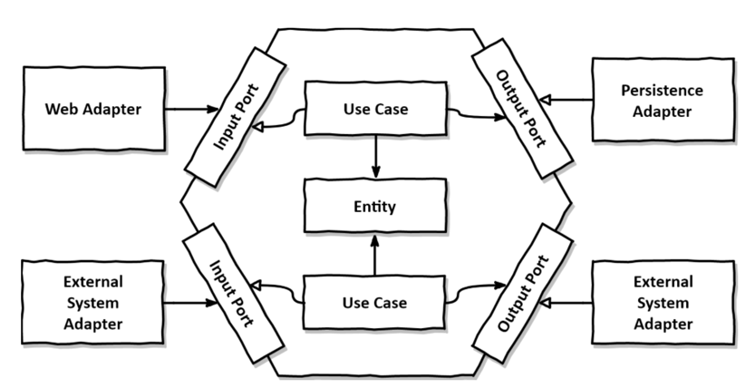
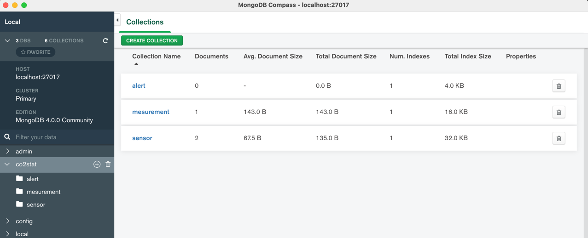

# CO2 Stat application built using Spring boot

## The Design
I have followed the DDD approach for this solution. Code and packages are structured so that it is easy to identify the components (entities, services, controllers, etc.), their purpose, and use cases of the system.

This solution follows the Hexagonal architecture  with layers such as adapter and Application.



The application layer has ports(use cases). The Service layer will be responsible for implementing those use cases.

The business logic is included in the Domain Classes.

All the input values to the program are validated in the controller layer. Exceptions are thrown accordingly with meaningful messages.

## The Solution
 1. The solution is implemented using Spring boot 2.5.5 and Java 11.
 2. The application is a stateless application which can be scaled based on the requirement
    1. If there are 100K sensors in the system and each sensor sends 1 request per minute, the API should be able to handle 100K request per minute.
    2. Inorder to achieve this, we can release this API to a scalable infrastructure and run load tests.
    3. With enough resources, this API should be able to handle 100K or many be more than that easily.
 3. All the data is stored in MongoDB. Spring boot has great support for MongoDB integration.
    1. I decided to use mongo db since these sensors collect enourmouse amounts of data within short periods of time and MondoDB is capable to 
       handle that.
    2. MongoDB is also a better choise when runnig queries such as getting the average of millions or records.
 4. Inorder to support transactions, I have used MongoDB [replica sets](https://docs.mongodb.com/manual/tutorial/deploy-replica-set-for-testing/).
 5. Application is unit tested to cover the most critical logic and codes using Junit4

## How to execute
1. Create MongoDB database.
   1. Database name should be ```co2stat```
   2. Create three collections. ```sensor```, ```alert``` and ```mesurement```

2. Execute "mvn install" from the project root folder
3. Go to target folder and execute ```java -jar co2stat-0.0.1-SNAPSHOT.jar```
4. Visit ```http://localhost:8081/status``` to check the API status

## API Documentation
The API is documented using Open API 3, and it is included in the codebase. Check the file names ApiDocument.json. 
Use Swagger UI or IntelliJ IDEA plugin to open it.

Email: harsha.kj89@gmail for support
